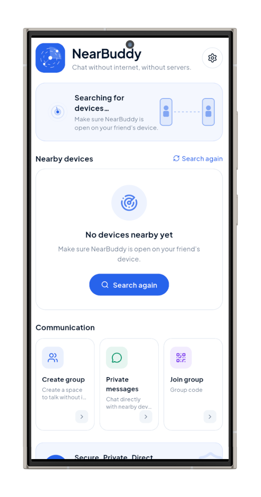
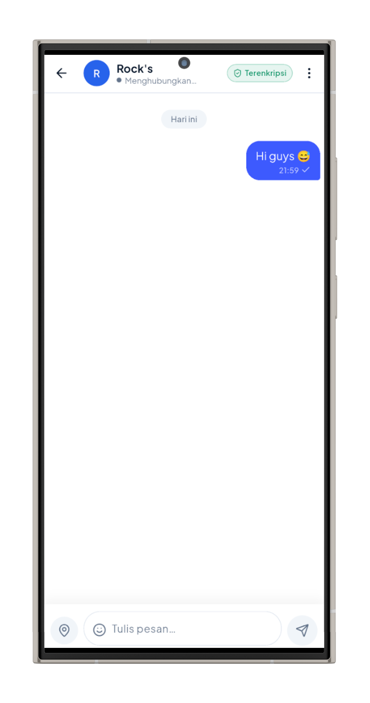
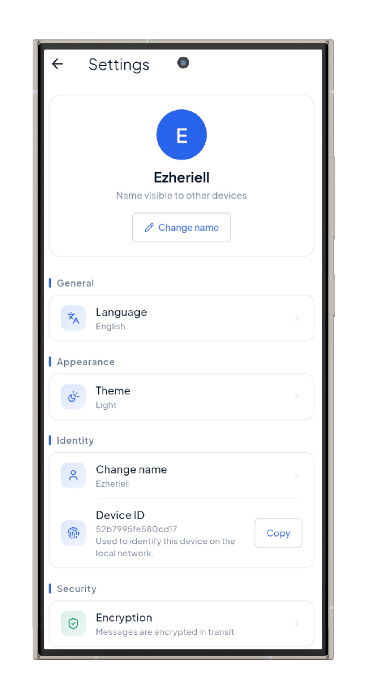
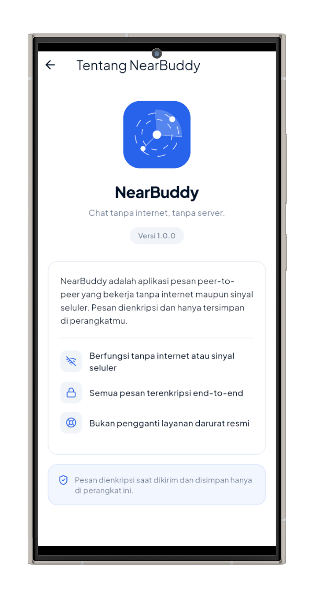

<div align="center">

# NearBuddy

**Offline-first P2P mesh messenger · Android · IOS · No internet required**


</div>

NearBuddy is a general-purpose peer-to-peer mesh messenger that works **without internet, cellular signal, or accounts**. On Android, group chats and 1:1 DMs travel over **Wi-Fi Direct / BLE** via [Google Nearby Connections](https://developers.google.com/nearby/connections/overview) and are **end-to-end encrypted by default** — X25519 identity keys, 6-digit SAS verification, and AES-GCM payloads. Messages stay only on the devices that carry them — no servers, no cloud, no telemetry. The iOS platform scaffold is included (target iOS 13); peer-to-peer networking there is planned for v1.1.

---

## 📥 Download

### 📱 Pre-built APKs (Android)

Get the latest release APK for your device architecture from [GitHub Releases](../../releases):

| Architecture | Device Type | APK File | Size |
|---|---|---|---|
| **ARM64 (`arm64-v8a`)** *(Recommended)* | Modern Android phones & tablets | `app-prod-arm64-v8a-release.apk` | ~18-24 MB |
| **ARMv7 (`armeabi-v7a`)** | Legacy 32-bit Android devices | `app-prod-armeabi-v7a-release.apk` | ~18-24 MB |
| **x86_64 (`x86_64`)** | Emulators & Intel/AMD Android devices | `app-prod-x86_64-release.apk` | ~18-24 MB |

> [!TIP]
> **Most Android devices use `arm64-v8a`**. If you are unsure which one to choose, download the ARM64 version.

---

## Screenshots

<div align="center">

| Home & Radar | Chat Room | Settings | About |
|:---:|:---:|:---:|:---:|
|  |  |  |  |

</div>

---

## Features

### 💬 Messaging

- **Group chat** (up to 30 members) and **1:1 direct messages** over a flood-routed P2P mesh — max **3 hops**, relay TTL **10 s**, UUID-based dedup (**30 s** cache)
- **Delivery receipts** per message: `pending` → `sent ✓` → `delivered ✓✓` / `failed` with manual retry
- **Typing indicator** for 1:1 chats
- **Location pings** — tap to open in Maps via `url_launcher`
- **Emoji picker** — offline curated catalog (5 categories, ~125 emoji), inserts at cursor, no network

### 🔐 Security

| Primitive | Detail |
| --- | --- |
| Key type | **X25519** identity key per device |
| Key storage | Private seed in **Android Keystore** via `flutter_secure_storage` |
| Cipher | **AES-GCM** — nonce (12 B) + ciphertext + MAC (16 B) |
| Identity | `deviceId` = first 16 hex of `sha256(pubkey)` — stable, unforgeable |
| Verification | **6-digit SAS** out-of-band comparison during key exchange |
| Relay nodes | Forward opaque envelopes — **cryptographically unable to decrypt** |

E2EE is a core invariant, not a feature flag.

### ✨ UX & Reliability

- **Ambient device discovery** — see nearby NearBuddy peers before joining anything; scan lifecycle tied to screen visibility to save battery
- **Real-time connection status** everywhere — connected / connecting / searching / out of range / radio off
- **Power-saver mode** — reduced advertising when battery is low
- **Theme picker** — light / dark / system, live phone mockups drawn with `CustomPaint`
- **Bilingual** — Indonesian (default) + English, runtime switchable
- **One-time legal disclaimer** on first launch

---

## How It Works

```
Nearby Connections (Wi-Fi Direct / BLE)
        ↓
  PeerDiscoveryService   (abstract)  ←  NearbyConnectionsService (impl)
        ↓
  KeyExchangeService     (X25519 + SAS handshake, group key delivery)
        ↓
  ChatController         (envelope seal/open, relay, ack/typing)
        ↓
  Drift (SQLite)         (schema v3: messages / groups / members / sessions)
        ↓
  Riverpod providers  →  UI (shadcn_ui + chat_bubbles)
```

### Wire format v2 (stable)

Every message is an opaque envelope: a **cleartext routing header** plus an **AES-GCM payload** (nonce + ciphertext + MAC). Relays route on the header alone — they never see plaintext.

```json
{
  "v": 2,
  "h": { "id": "<msgId>", "gid": "<sessionId>", "to": "<deviceId>", "hop": 0, "max": 3, "ts": 0, "k": "<groupKeyHint>" },
  "n": "<b64 nonce 12B>",
  "c": "<b64 ciphertext||MAC>"
}
```

Hop-local **control messages** (`hello`, `key`, `verify_ok`, `verify_fail`) are never relayed; `ack` (delivery receipts) and `typing` are flooded hop-by-hop and filtered by recipient.

### Operational constraints

| Constraint | Value |
| --- | --- |
| Max relay hops | 3 |
| Relay TTL | 10 s |
| Dedup cache | 30 s |
| Max group size | 30 members |
| Max message length | 500 chars |
| Message retention | 7 days |
| Nickname | 3–20 chars, unique per group (display only) |
| Platform | Android only · `minSdk 23` · `targetSdk 34` |

---

## Getting Started

### Prerequisites

- Flutter **3.44+** (Dart 3.12) — older versions may work but are untested
- Android device or emulator with **Bluetooth + Location** permissions granted at first run
- No Google account, no Firebase project, no network access required

### Run / Build — always via the flavor script

> Plain `flutter run` / `flutter build` compiles **without** the `FLAVOR` dart-define and produces a misconfigured app. Always use `scripts/flavor.ps1`.

```powershell
# Debug run (dev flavor, hot reload)
.\scripts\flavor.ps1 -Flavor dev -Action run

# Debug APK (large, dev only — ~165–230 MB, never distribute)
.\scripts\flavor.ps1 -Flavor dev -Action build

# Obfuscated release — 3 split APKs (per ABI, ~18–24 MB each)
.\scripts\flavor.ps1 -Flavor prod -Action release

# Single android-arm64 release APK (internal builds)
.\scripts\flavor.ps1 -Flavor dev -Action release -Arm64Only
```

**Release builds** are obfuscated (`--obfuscate`); stack-trace symbols are saved to `build/symbols/<flavor>`. Debug APKs embed the kernel blob + JIT engine + Vulkan validation layer, which is why they are huge — never distribute them.

### Flavors

| | `dev` | `prod` |
| --- | --- | --- |
| applicationId | `…dev` suffix | clean |
| App label | NearBuddy Dev | NearBuddy |
| Database | `nearbuddy_db_dev` | `nearbuddy_db` |
| Nearby service IDs | `com.nearbuddy.dev.*` | `com.nearbuddy.*` |

Dev and prod builds **never see each other on the mesh** (isolated service IDs).

### Tests

```bash
flutter test                         # full suite (43 tests)
flutter test test/<path>.dart -v     # single test
```

Pure-Dart crypto tests need no device or plugin. Drift tests use an in-memory database. Widget tests wrap screens in `ShadApp`.

### Codegen

Run these after structural changes — never hand-edit the generated files:

```bash
# After editing tables/, daos/, or app_database.dart
flutter pub run build_runner build

# After editing lib/l10n/*.arb
flutter gen-l10n

# Regenerate launcher icons (writes Android res PNGs; no device needed)
flutter test tool/logo_render_test.dart
```

---

## Architecture

### Stack (resolved versions)

| Area | Package |
| --- | --- |
| UI | `shadcn_ui` ^0.56.1 · `chat_bubbles` ^1.10.1 (presentation wrapper) |
| State | `flutter_riverpod` 2.6.1 · `riverpod` 2.6.1 |
| Persistence | `drift` 2.31.0 (+ `drift_flutter`) · `shared_preferences` 2.5.5 |
| Networking | `nearby_connections` 4.3.0 · `permission_handler` 11.4.0 |
| Crypto | `cryptography` 2.9.0 · `flutter_secure_storage` 9.2.4 |
| Location / battery | `geolocator` 12.0.0 · `battery_plus` 7.1.1 (pinned — 6.x triggers the KGP warning) |
| Navigation / misc | `go_router` 14.8.1 · `uuid` 4.6.0 · `url_launcher` 6.3.2 · `intl` 0.20.2 |

### Design Principles

- **`PeerDiscoveryService` is the only interface** business logic touches — `nearby_connections` is never imported outside `infrastructure/`
- **Drift schema v3** with versioned migrations (v1→v2 adds `to`, `publicKey`, `sessions`; v2→v3 adds message `status` for delivery states)
- **Semantic theme tokens** (`NearBuddyColorScheme` light/dark) — screens never hardcode colors; theme persists across launches
- **Riverpod lifecycle discipline** — every async handler re-checks `mounted` after each `await`; all timers and subscriptions are cancelled in `dispose`
- **Typography system** centralised in `lib/theme/nearbuddy_typography.dart` — body: `Plus Jakarta Sans`, display: `Hanken Grotesk`, mono: `IBM Plex Mono` (OFL, bundled)

### Project structure

```
lib/
├── main.dart                 # Application entry point & ProviderScope initialization
├── app.dart                  # ShadApp + MaterialApp.router setup & global theme binding
├── core/                     # Application core configuration & utilities
│   ├── crypto/               # X25519, AES-GCM, HKDF, & SAS cryptographic primitives
│   ├── app_config.dart       # Environment configuration & flavor definitions (dev/prod)
│   ├── constants.dart        # Global app constants (app version, retention, limits)
│   ├── emoji_catalog.dart    # Offline curated emoji catalog (5 categories, ~125 emojis)
│   ├── feature_flags.dart   # Feature toggle definitions
│   └── router.dart           # GoRouter route definitions & navigation guards
├── data/                     # Persistence & local storage layer
│   ├── database/             # Drift DB schema v3, migration logic, DAOs, & tables
│   └── preferences/          # SharedPreferences wrapper for user settings & theme mode
├── domain/                   # Business domain contracts, models, & service logic
│   ├── models/               # Message, MessageEnvelope, KeyPayloads, & GroupSession models
│   └── services/             # PeerDiscoveryService interface & KeyExchangeService
├── infrastructure/           # Low-level platform & network implementations
│   └── nearby/               # NearbyConnectionsService (Google Nearby Connections impl)
├── features/                 # Modular UI screens & feature logic
│   ├── chat/                 # Group & 1:1 DM chat screens, ChatController, & message bubbles
│   ├── group/                # Group creation, joining, QR code scanner, & SAS verification
│   ├── home/                 # Home screen, ambient peer radar, & scan controller
│   ├── onboarding/           # Welcome flow, nickname selection, & legal disclaimer
│   ├── settings/             # Settings screen, language picker, & custom theme sheet
│   └── shared/               # Reusable UI widgets (NearBuddyButton, Avatar, EmptyState)
├── l10n/                     # ARB localization files (id/en) & generated AppLocalizations
└── theme/                    # Semantic color tokens, typography system, & brand logo painter
```

---

## Privacy

- **Zero network calls** — no Firebase, no cloud, no telemetry, no analytics of any kind
- Keys never leave the device; group keys are session-scoped in memory
- Relay nodes are cryptographically unable to read message content or derive keys

---

## Known Limitations

| Limitation | Rationale |
| --- | --- |
| No forward secrecy | Double-ratchet is explicitly out of scope |
| No rekey on member leave | Group key is memory-scoped; app restart triggers re-key |
| Manual retry for failed messages | No automatic store-and-forward by design |
| DM requires prior group contact | Peer public key must be known before a DM session |
| No at-rest encryption | SQLCipher deferred |

Intentionally out of scope: `flutter_map`, SOS, voice messaging, cloud sync.
